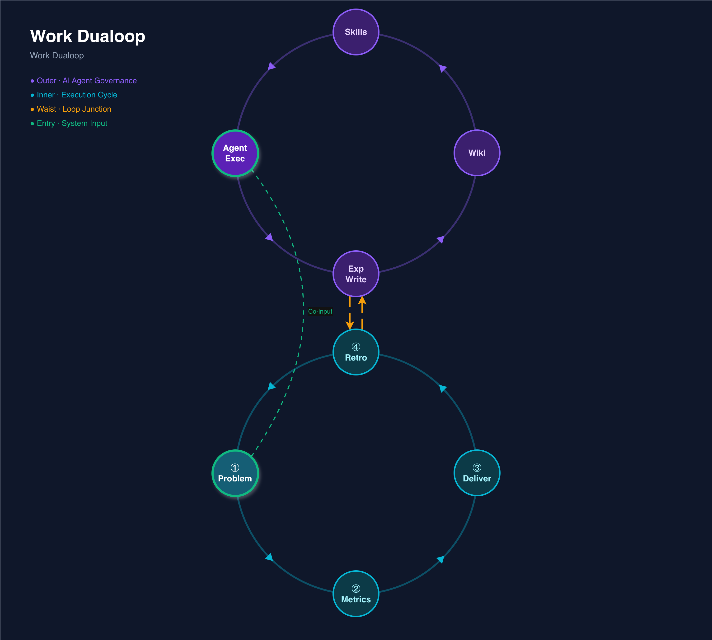

# LLM Dualoop — A Self-Evolving Dual-Loop Work System Powered by LLMs

[中文](./README.md) | **English**

> Inspired by Andrej Karpathy's [LLM Wiki](https://gist.github.com/karpathy/442a6bf555914893e9891c11519de94f) pattern.



---

## Core Idea

The [**Work Feedback Loop**](./references/work-feedback-loop.md) is a methodology I distilled from practice: any work can be decomposed into four nodes — *Problem Definition → Metrics Construction → Solution Delivery → Retrospective* — forming a closed loop. Lessons from each retrospective become the starting point for the next cycle.

But knowledge accumulation has always been the bottleneck — people forget, cut corners, and skip summaries. Karpathy's [LLM Wiki](https://gist.github.com/karpathy/442a6bf555914893e9891c11519de94f) offered the missing piece: let the LLM incrementally build and maintain a persistent knowledge base — knowledge **compiled once and kept current**, rather than re-derived from scratch every time.

**LLM Dualoop** combines both:

- **Inner loop** from the Work Feedback Loop — a four-node execution cycle, fully automated by the Agent, delivering work results
- **Outer loop** inspired by LLM Wiki — the Agent compiles experience into Skills and Wiki after each retrospective, accumulating knowledge over time

The two loops interlock into a figure "8": the inner loop produces results, the outer loop grows wisdom. The more you use it, the smarter it gets.

---

## Dual-Loop Structure

### Inner Loop: Execution Cycle

```
① Problem Definition → ② Metrics Construction → ③ Solution Delivery → ④ Retrospective → ①…
```

| Node | What it does |
|------|-------------|
| **① Problem Definition** | System entry point. Fully understand and define the problem |
| **② Metrics Construction** | Establish quantifiable metrics and analytical framework |
| **③ Solution Delivery** | Generate multiple solutions, pick the best, deliver working code or docs |
| **④ Retrospective** | Evaluate output against metrics, distill positive/negative lessons |

The human only needs to input a one-sentence problem. The Agent runs all four nodes automatically and delivers the result.

### Outer Loop: Knowledge Governance

```
Agent Execution → Experience Write-back → Wiki → Skills → Agent Execution…
```

After each inner loop completes, the Agent automatically distills experience into:

- **Skills** (how to do it): operational standards, steps, constraints — behavioral reference for the Agent's next execution
- **Wiki** (what it is): domain knowledge, context, decision records — the knowledge foundation for understanding context

This is the LLM Wiki pattern in action: **the wiki is a persistent, compounding artifact** that gets richer with every task.

### The Waist: Where the Two Loops Cross

The inner loop's "④ Retrospective" and the outer loop's "Experience Write-back" connect bidirectionally at the waist:

- Retrospective generates lessons → written into Skills/Wiki
- Skills/Wiki updates → feed back into the next Agent execution

This is the quality anchor of the entire system.

---

## Mapping to LLM Wiki

| LLM Wiki Concept | Dualoop Mapping |
|-------------------|----------------|
| **Raw Sources** | `raw/` (open-source Skills, reference articles, open ideas & methodologies) + `runs/` task records — immutable source material |
| **Wiki** | `wiki/` + `skills/` — Karpathy's wiki carries both knowledge and conventions; Dualoop splits them into two layers |
| **Schema** | `schema/` framework definitions — tells the Agent "how to maintain this system" |
| **Ingest** | Retrospective → Experience Write-back — distill knowledge from task output, compile into wiki/skills |
| **Query** | Agent invokes wiki/skills during inner loop execution — answers based on compiled knowledge, not raw retrieval |
| **Lint** | Periodic consistency and accuracy checks on wiki/skills — keeping the knowledge base healthy |

As Karpathy put it:

> "The tedious part of maintaining a knowledge base is not the reading or the thinking — it's the bookkeeping."

Dualoop's outer loop lets the LLM handle all the bookkeeping — summarizing, cross-referencing, maintaining consistency. The human's role is **problem-setter** and **curator**, not executor.

---

## Key Principles

1. **Every task produces two outputs.** Inner loop work results + outer loop knowledge updates. Both are non-negotiable.
2. **Knowledge is compiled, not retrieved.** Skills/Wiki are continuously built and maintained, not re-derived from scratch.
3. **Humans ask, Agents execute.** Humans only participate at input and acceptance. Everything in between is fully automated.
4. **The more you loop, the better it gets.** Outer loop knowledge accumulation continuously improves inner loop execution quality.

---

## Getting Started

This is not a specific software implementation — it's a **work pattern**. You can practice it with any LLM Agent:

1. Give your Agent a workspace with `runs/` (task records), `skills/` (operational standards), `wiki/` (domain knowledge)
2. Create a new task under `runs/`, describe the problem clearly
3. Have the Agent run through *Problem Definition → Metrics Construction → Solution Delivery → Retrospective*
4. After retrospective, have the Agent write lessons into `skills/` and `wiki/`
5. Next task, the Agent automatically draws on previously accumulated knowledge

Repeat the cycle, and your Agent gets better at your domain over time.

---

## Acknowledgments

- **Andrej Karpathy** — [LLM Wiki](https://gist.github.com/karpathy/442a6bf555914893e9891c11519de94f) introduced the core pattern of LLMs incrementally building persistent knowledge bases. It is the direct inspiration for this project's outer loop design. The original text is included in [`references/karpathy-llm-wiki.md`](./references/karpathy-llm-wiki.md).

---

## License

[Apache License 2.0](./LICENSE)
