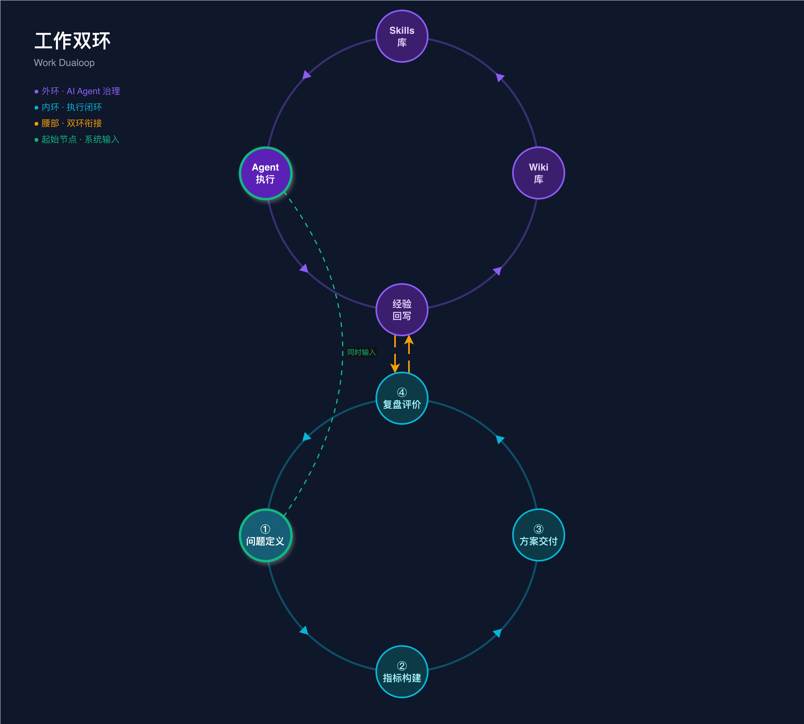

# LLM Dualoop — 用 LLM 自动维护的工作双循环

**中文** | [English](./README.en.md)

> Inspired by Andrej Karpathy's [LLM Wiki](https://gist.github.com/karpathy/442a6bf555914893e9891c11519de94f) pattern.



---

## 核心思想

[**反馈闭环工作法**](./references/work-feedback-loop.md)是我从实践中总结的一套方法论：任何工作都可以拆解为「问题定义 → 指标构建 → 方案交付 → 复盘评价」四个节点，形成闭环。每一轮复盘的经验，成为下一轮的起点。

但经验积累一直是瓶颈——人会遗忘、会偷懒、会跳过总结。Karpathy 的 [LLM Wiki](https://gist.github.com/karpathy/442a6bf555914893e9891c11519de94f) 给了我启发：让 LLM 增量构建和维护一个持久化的知识库，知识被**编译一次然后持续更新**，而不是每次从零推导。

**LLM Dualoop** 就是两者的结合：

- **内环**来自反馈闭环工作法——四节点执行闭环，Agent 自动跑完，交付工作结果
- **外环**借鉴 LLM Wiki 模式——Agent 在复盘时自动把经验编译进 Skill 和 Wiki，让知识持续积累

两个环交错成数字「8」，内环出结果，外环长智慧，越用越聪明。

---

## 双环结构

### 内环：执行闭环

```
① 问题定义 → ② 指标构建 → ③ 方案交付 → ④ 复盘评价 → ①…
```

| 节点 | 做什么 |
|------|--------|
| **① 问题定义** | 系统入口。充分理解和定义问题 |
| **② 指标构建** | 建立可量化的指标与分析框架 |
| **③ 方案交付** | 生成多个方案，择优执行，交付可用的代码或文档 |
| **④ 复盘评价** | 对照指标检验产出，提炼正/负向经验 |

人只需要输入一句话的问题。Agent 自动跑完四个节点，交付工作结果。

### 外环：知识治理

```
Agent 执行 → 经验回写 → Wiki 库 → Skills 库 → Agent 执行…
```

每次内环完成后，Agent 自动将经验提炼写入：

- **Skills**（怎么做）：操作规范、步骤、约束——Agent 下次执行时的行为参考
- **Wiki**（是什么）：领域知识、背景、决策记录——Agent 理解上下文的知识底座

这正是 LLM Wiki 模式的实践：**wiki 是一个持久的、复合增长的制品**，每次任务都让它更丰富。

### 腰部：两环的交叉点

内环的「④ 复盘评价」与外环的「经验回写」在腰部双向衔接：

- 复盘产生经验 → 经验写入 Skill/Wiki
- Skill/Wiki 更新 → 反哺下一轮 Agent 执行

这是整个系统质量的锚点。

---

## 与 LLM Wiki 的映射

| LLM Wiki 概念 | Dualoop 映射 |
|--------------|-------------|
| **Raw Sources** | `raw/`（开源 Skills、参考文章、开放的思想与方法论）+ `runs/` 历次任务记录——不可变的原始素材 |
| **Wiki** | `wiki/` + `skills/` — Karpathy 的 wiki 同时承载知识和规范，Dualoop 拆为两层 |
| **Schema** | `schema/` 框架定义 — 告诉 Agent "怎么维护这套系统"的约定 |
| **Ingest** | 复盘评价 → 经验回写 — 从任务产出中提炼知识，编译进 wiki/skills |
| **Query** | Agent 执行内环时调用 wiki/skills — 基于已编译的知识执行，而非从零检索 |
| **Lint** | 定期检查 wiki/skills 准确性与一致性 — 保持知识库健康 |

Karpathy 说得好：

> "The tedious part of maintaining a knowledge base is not the reading or the thinking — it's the bookkeeping."

Dualoop 的外环就是让 LLM 承担所有的 bookkeeping——总结、交叉引用、一致性维护。人的角色是**出题人**和**策展人**，不是执行者。

---

## 关键原则

1. **Every task produces two outputs.** 内环任务结果 + 外环知识更新，缺一不可。
2. **知识是编译的，不是检索的。** Skill/Wiki 被持续构建和维护，不是每次从零推导。
3. **人出题，Agent 执行。** 人只介入输入和验收，中间全自动。
4. **双环交错，越用越好。** 外环的知识积累让内环的执行质量持续提升。

---

## 快速开始

这不是一个具体的软件实现，而是一个**工作模式**。你可以用任何 LLM Agent 来实践它：

1. 给你的 Agent 一个工作目录，包含 `runs/`（任务记录）、`skills/`（操作规范）、`wiki/`（领域知识）
2. 在 `runs/` 下新建任务，写清问题
3. 让 Agent 按「问题定义 → 指标构建 → 方案交付 → 复盘评价」跑一遍
4. 复盘后让 Agent 把经验写入 `skills/` 和 `wiki/`
5. 下次任务，Agent 会自动调用上次积累的知识

反复循环，你的 Agent 会越来越懂你的领域。

---

## 致谢

- **Andrej Karpathy** — [LLM Wiki](https://gist.github.com/karpathy/442a6bf555914893e9891c11519de94f) 提出了 LLM 增量构建持久化知识库的核心模式，是本项目外环设计的直接灵感来源。原文收录在 [`references/karpathy-llm-wiki.md`](./references/karpathy-llm-wiki.md)。

---

## License

[Apache License 2.0](./LICENSE)
