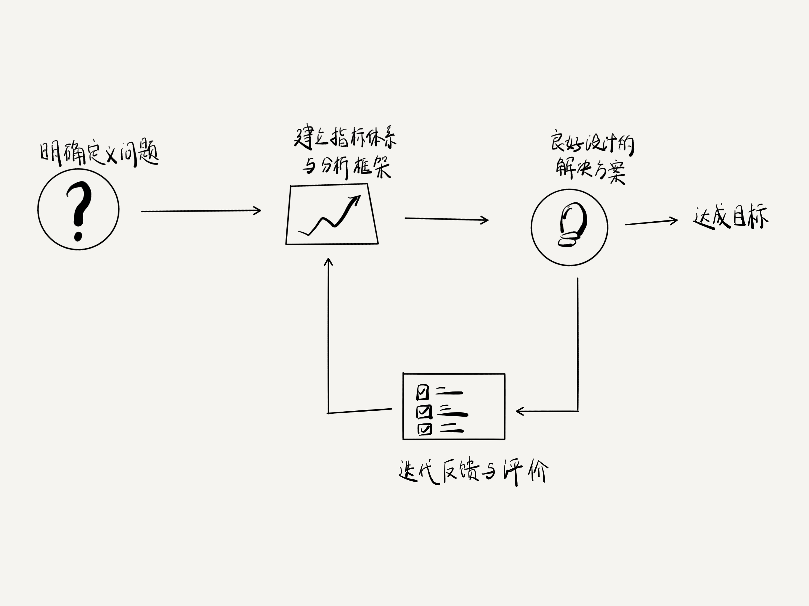

下图结构是一个典型的自动化控制反馈回路（近似）：通过不断的反馈迭代，让结果无限趋于初始时通过明确定义问题而设立的目标。

+ 明确定义问题：整个系统的输入，非常重要！需要对遇到的问题/需求/风险进行充分思考和定义。
+ 建立指标体系与分析框架：旨在分解问题（目标）、接收反馈、输出决策，指引解决问题、达成目标的正确方向。目标需要清晰，并能在一定时间周期 (1-2周、1-2月) 完成。指标贴合问题定义，明确可量化。
+ 良好设计的解决方案：解决方案设计的灵活、代码写的优美、健壮，会使得迭代效率更高，过程更佳。方案设计可以产出3-5份，充分分析方案优劣，再做选型，不要1-2个方案会出现考虑不周或两难抉择。
+ 迭代反馈与评价：这是反馈回路的核心，回路或者说这套方法能够成立，充要条件即需要迭代反馈与评价这一步骤。需求/项目/风险/故障 均需要做好复盘，以便下一次迭代能够避坑。

过程中的反馈与评价能够调整指引方向的指标体系与分析框架；而最后的复盘总结也为了下一轮新问题的解决提供方法依据。让每一次行动都能够有经验的累积（正向或负向的经验都是有价值的）。

<!-- 这是一张图片，ocr 内容为：建立指标体系 良好没计的 明确定义问题 与分析框架 解决方案 达成目标 迭代反馈与评价 -->
  
_图：反馈闭环工作法_

